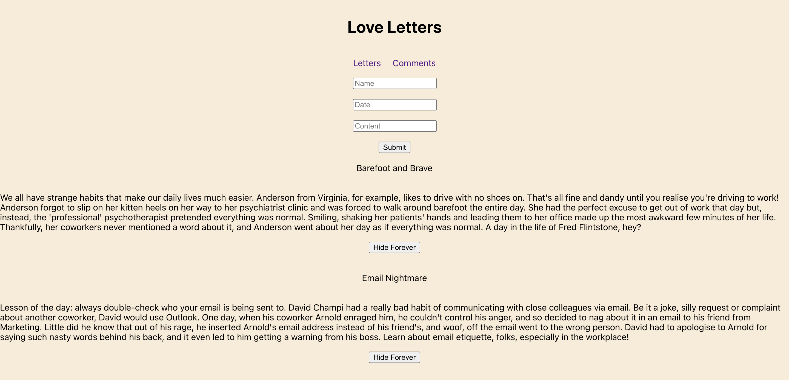
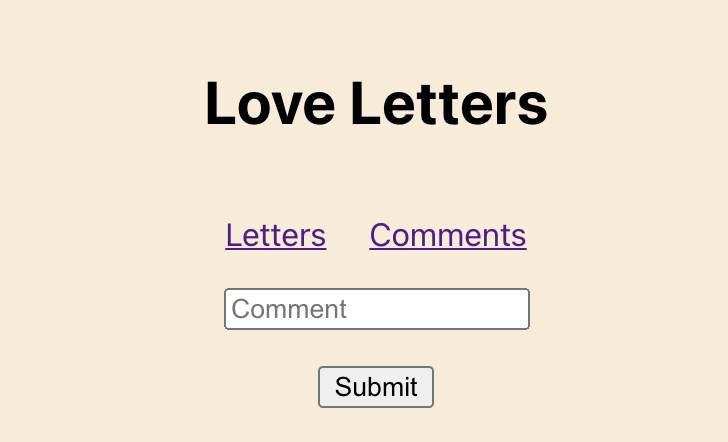
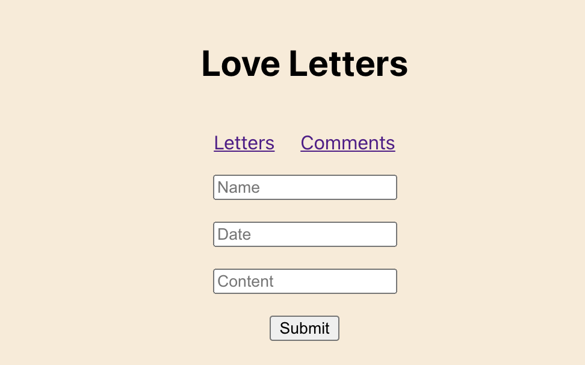

# Love Letters

## Date: 9/03/2021

#### By: Jin Yang Brancalhao

[CHD](https://lucid.app/lucidchart/d70eb34b-e92b-42b3-8f29-5388c03312b1/edit?page=0_0#)

[ERD](https://lucid.app/lucidchart/641dccf2-0b65-4070-bc51-0f4f2360a0a0/edit?beaconFlowId=331BEB8B9B18CD00&page=0_0#)

[Git](https://github.com/jinyangb/LoveLetters)

---

**_Description_**

This App is designed to be a place you can rant. This is a safe space to express yourself. To write that letter to yourt boss you always wanted to and not get fired because they never actually get it. You can add a letter and delete a letter. If you want to comment on a letter you like or talk about them you can go to the comments page and use that as a discussion board.

**_Technologies Used_**

- React
- MongoDB
- Mongoose
- MongoDB Atlas
- Heroku
- Express
- Node

**_Getting Started_**

This app will be deployed with Heroku. Enjoy sharing your experiences!

[Love Letter](https://evening-hollows-49481.herokuapp.com/)

[Trello](https://trello.com/b/Z54J06Ya/love-letter)

**_Screenshots_**

#####

#####

#####

**_Future Updates_**

- [ ] Add User Login
- [ ] Use Bootstrap
- [ ] Add Comment to Specific Letter

**_Credits_**

Stackoverflow
